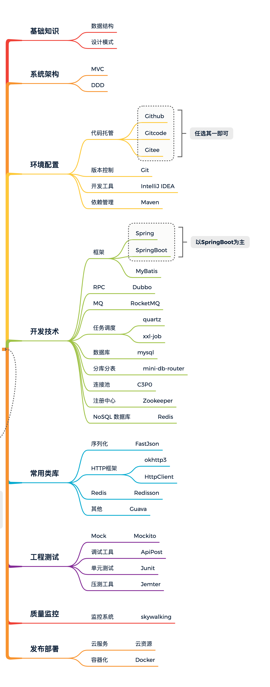

## 一、前言：授业解惑

```
我知道，你并不知道从哪开始！
```

你了解要成为一个软件开发工程师，要从哪里开始学习吗？你清楚为了能找到工作要学习多少知识吗？你知道从承接需求到开发交付上线需要多少个技术栈吗？

对于这些内容即使从事编程2-3年的研发，大部分人也没有一个全局的概括，而在校大学生更是不清楚自己是从哪开始要到哪里去。收集了几十G到几百G的资料也不知道要从哪开始看，看哪些是对自己当前阶段帮助最大的。

## 二、简明：学习路线

