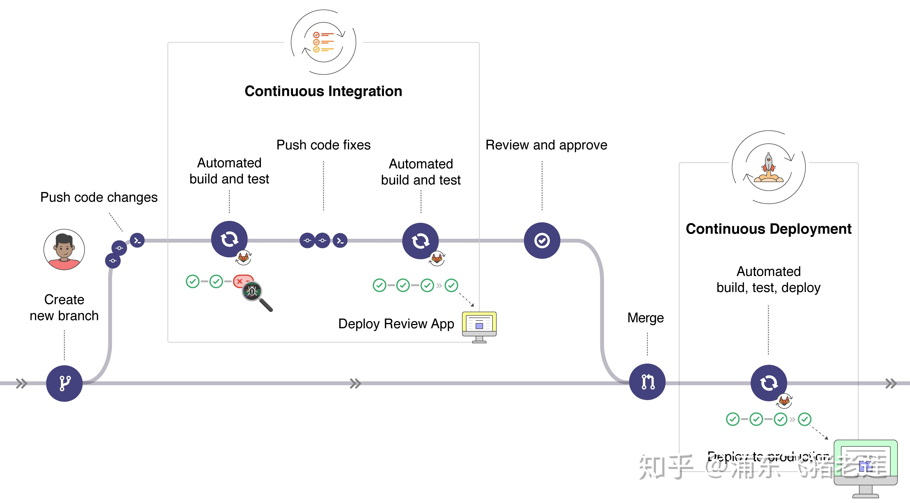

# CICD

## 简介

> CICD 是 持续集成（Continuous Integration）和持续部署（Continuous Deployment）简称。指在开发过程中自动执行一系列脚本来减低开发引入 bug 的概率，在新代码从开发到部署的过程中，尽量减少人工的介入。

### 持续集成

> 持续集成指在和向远程仓库 push 代码后，在这次提交合并入主分支前进行一系列测试，构建等流程。假设现在有个应用的代码存储在 gitlab 上，每天开发者都 push 很多次提交，针对每次 push，你可以创建一系列脚本进行自动测试，降低往应用里引入错误的概率。这就是持续集成，它可应用在包括开发分支在内的多个分支上。

### 持续部署

> 持续部署在持续集成的基础上更进一步，指将推送指仓库默认分支的部署至产品环境。如果这部分需要手动触发，这就是一个持续交付（Continuous Delivery）环节。

CICD工作流程

> Gitlab 内置了 CICD 工具，不需要使用第三方工具。