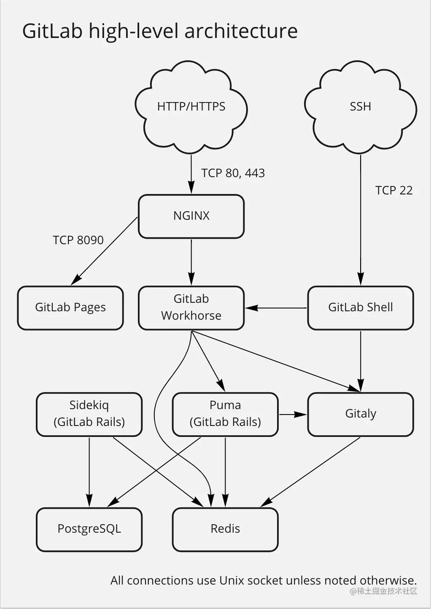

# GitLab

## gitlab概述

> gitlab是一个用于仓库管理系统的开源项目，使用git作为代码管理工具



## gitlab安装

> 安装包下载地址https://mirrors.tuna.tsinghua.edu.cn/help/gitlab-ce/
> 离线安装，安装包1G多，下载地址：https://mirrors.tuna.tsinghua.edu.cn/gitlab-ce/yum/el7/gitlab-ce-15.9.2-ce.0.el7.x86_64.rpm
> 建议采用迅雷下载后，上传到服务器中

使用yum安装

```shell
touch /etc/yum.repos.d/gitlab-ce.repo
vi /etc/yum.repos.d/gitlab-ce.repo
[gitlab-ce]
name=Gitlab CE Repository
baseurl=http://mirrors.tuna.tsinghua.edu.cn/gitlab-ce/yum/el$releasever/
gpgcheck=0
enabled=1

sudo yum makecache
sudo yum install gitlab-ce
```


## .gitlab-ci.yml文件说明

> .gitlab-ci.yml 是指定了 CICD 相关配置的 YAML 文件。（YAML 是专门用来写配置文件的语言，简洁强大，和 python 一样用缩进代表层级，表达能力和 JSON 基本一致，但格式更方便。相关知识可以参考阮昱峰老师的[博文](https://link.zhihu.com/?target=http%3A//www.ruanyifeng.com/blog/2016/07/yaml.html)。

一般而言，CICD 过程会包含如下最外层的 key：

- `stages`: 定义整个 CICD pipeline 的 `job` 数量和名称
- `variables`: 定义 CICD 流程中的一些环境变量
- `before_scripts`: 在每个 `job` 的 `scripts` 执行前进行的命令集，一般是创建目录，打印 context 目录等操作，可类比 `unittest` 的 `setUp` 方法
- `stage`: 定义了一个 `job` 的具体流程，可以在前面加上名称

示例：

```yaml
tages:
  - test
  - build
  - deploy

variables:
  GIT_STRATEGY: none
  PROJECT_REPO_NAMESPACE: test
  PROJECT_REPO_NAME: cicd_learn
  DEPLOYMENT_REPO_NAMESPACE: test
  DEPLOYMENT_REPO_NAME: deploy_test

before_script:
  - export ROOT_PATH=$(pwd)
  - echo 'root path:' $ROOT_PATH
  - mkdir $PROJECT_REPO_NAME
  - cd $PROJECT_REPO_NAME
  - <some git manipulation here>
  - echo 'date:' $DATE

test_stage:
  stage: test
  script:
    - <test related command here>
  artifacts:
    paths:
      - xxxx.html
    when: always
  allow_failure: false

build_stage:
  stage: build
  script:
     - <build related command here>
  when: manual
  allow_failure: false
  only:
    - master

deploy:
  stage: deploy
  script:
    - <deploy related command here>
  allow_failure: false
  only:
    - master
```

### stages

例子中 `stages` 值为一个数组（p.s. 用 - 代表数组和 markdown 类似）。包含了三个 `job`，`test`, `build`, `deployr` 分别实现自动测试，打包项目和部署。下方的 `stage` 必须在全局定义的 `stages` 内。

### variables

值为键值对象，为了后续的流程，此处定义了开发项目和部署项目的 namespace 和 repo_name。同 shell 类似，后续使用其值需要加上 $ 符号。定义的变量也有对应的作用域，定义在顶层就可以作为全局变量供所有 `job` 使用，如果是一些 `job` 特有的变量，就定义在 `job` 内部。

### before_script

值为数组，每一个元素其实就是一个 linux 命令，写的时候装作自己在写 shell 就好。该部分主要生成了后续构建需要的镜像标签，切换当前目录等。为了 debug 方便，这些变量最好打印。类似的，如果在 `job` 完成后有一些时候操作，可以定义 `after_script`。需要注意的是如果定义在顶层，内部的命令会在每个 `job` 运行之前执行，如果某些 `job` 需要特别的预操作，可以在 job 内部再配置一个 `before_script` 对象，它会复写外部的全局预操作。

### test_stage

名为 `test` 的 `job` 的具体配置，一般是个复合对象。

### stage

`job` 对应的 `stage`，如果有多个 `job` 对应同一个 `stage`，在执行时会并行执行这些 `job`。

### script

这个 `job` 执行的命令，此处是进入的项目仓库目录，并且执行了一个 shell 脚本，这个脚本定义了执行项目的所有单元测试。一般建议如果要执行的命令过多，就把这些命令写成脚本放在项目内。CICD 流程直接执行这个脚本。

### artifacts

这个对象用来定义 `job` 的产出，比如我们让 `test_stage` 产出一个 html 格式的报告，显示每个单元测试的执行情况（报告生成相关代码写在项目内）。 数组内的 `paths` 和 `when` 分别定义报告的路径和产出场景。此处表示报告放置于根目录下，任何时候都要提供报告。设定正确后，就可以 Gitlab 的 pipline 页面上可以下载相关文件。

### allow_failure

见名知意，如果值为 true，那么即使没通过测试，也可以执行后续的 `job`.

### build_stage

该步骤在测试通过的基础上，把项目编译打包，方便后续部署。

### when

此处的 `when` 定义在 `job` 内的顶层，值为 manual 表示其需要在 Gitlab 上手动触发（页面上点击按钮即可）。

### only

`only` 指明了 `job` 的执行场景，可以是分支名，表明只有 master 分支可以执行 `build`，如果要用排除法反向指定，可以用 `except`。

### deploy_stage

所有的 key 现在你应该都了解了，这里不再赘述。这一步骤主要是将部署产品的服务器上的内容更新。