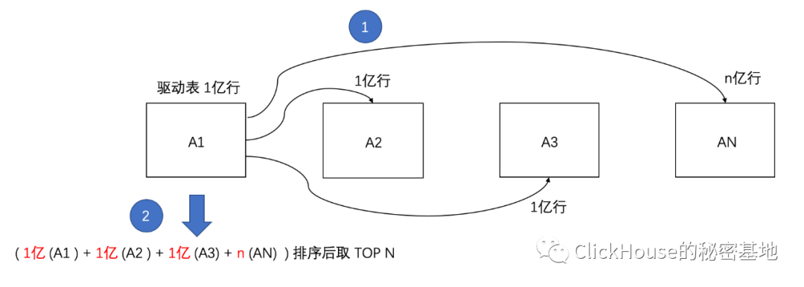
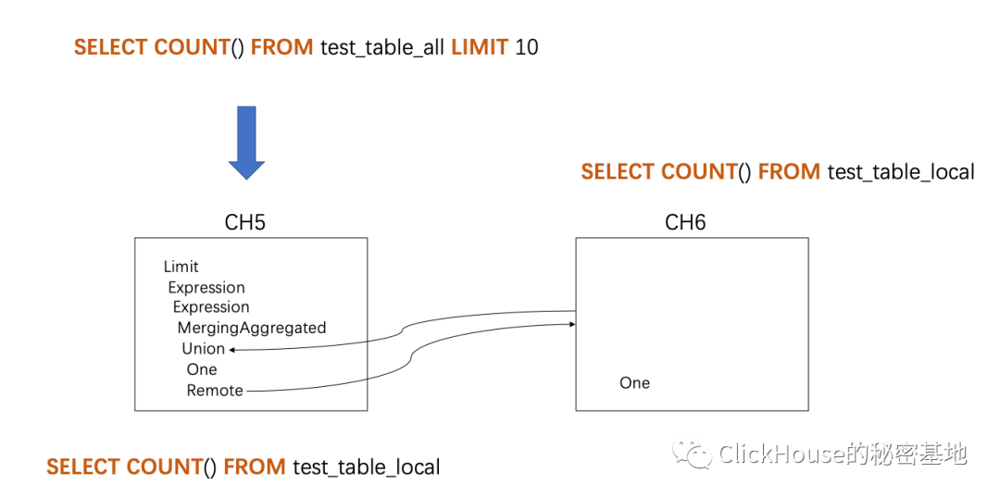
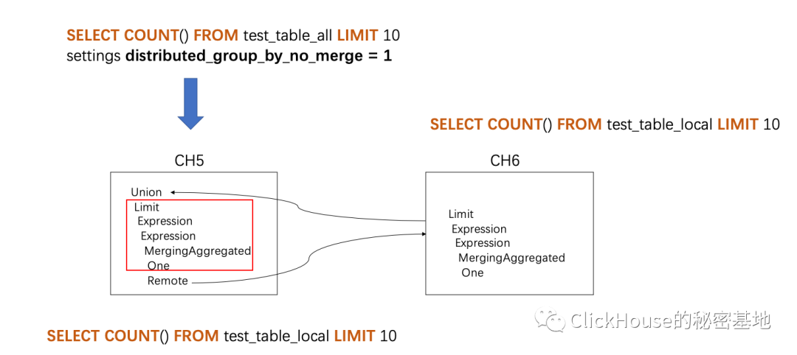

# ClickHouse 中避免深度分页问题

> 在日常的业务场景中，我们经常会遇到查询 TOP N 的需求。在 [ClickHouse](https://cloud.tencent.com/product/cdwch?from=10680) 中，一种常见的实现 TOP N 的 SQL 模板如下所示

```sql
SELECT A FROM table
GROUP BY A
ORDER BY COUNT() DESC
LIMIT 10
```

简而言之，就是在排序后利用 LIMIT 子句返回限定的前 N 行数据。

模拟了一段top N相识的SQL

```sql
SELECT type FROM test_table_all 
GROUP BY type 
ORDER BY COUNT() 
LIMIT 10
```

数据表 test_table_all 是一张分布式表，使用了 Distributed 表引擎。当我们对这张表执行上述语句后，整个查询过程会如下图所示:



test_table_all 有 N 个分片，当我们在 A1 分片所在节点发起查询时，A1 将成为驱动节点，分别向其他远端分片发起查询请求。

为了确保结果正确，所有分片的数据会统一汇总到 A1 节点之后再进行后续操作。

假设 A2 和 A3 分片各有 1亿 行数据，则它们会将各自的 1 亿行数据通通返回给 A1 驱动节点，再由 A1 汇总之后进行排序、LIMIT操作。

可以看到，虽然最终只需要返回 10 行数据，但整个查询过程中涉及了大量的数据传输。

如果上面的描述不够直观，那么我再用 SQL 执行计划进一步说明。

为了降低干扰，我将上述的 SQL 进一步简化成下面的样子:

```sql
SELECT COUNT() FROM test_table_all LIMIT 10
```

假设 test_table_all 有两个分片，分别对应 CH5 和 CH6 两个节点，那么在 CH5 节点执行上述语句后，执行计划会是下面的样子:



注意看图中 CH5 的执行计划，它驱动了整个查询过程:

首先，通过 Remote 向远端分片 CH6 发起查询。与此同时，也通过 One 向本地分片发起查询;

注意，CH6 在查询的时候是没有 LIMIT 操作的，也就是说他会返回满足条件内的所有数据 ;

接着，CH5 通过 Union 合并分片的结果；

最后，将合并的数据进行加工，最终通过 LIMIT 取 TOP N。

在这位网友的业务场景中，并不强制要求精准 TOP N，所以如果每次查询都需要在驱动节点汇总数据，性能开销就太浪费了。

一种理想的实现方法是，首先分别在每个分片节点求各自的 TOP N，然后再到驱动节点汇总求近似的 TOP N。

那么这种查询在 ClickHouse 中可以实现吗？答案当然是能啦 !

为了实现上述需求，我们需要用到 distributed_group_by_no_merge 参数，这个参数有什么作用？我们看看便知。

假设 test_table_all 有 2 个分片，共计 100000 行数据。

首先执行普通的分布式查询:

```sql
ch5.nauu.com :) SELECT any(_shard_num) ,COUNT() FROM test_table_all

SELECT 
    any(_shard_num), 
    COUNT()
FROM test_table_all

┌─any(_shard_num)─┬─COUNT()─┐
│               1 │  100000 │
└─────────────────┴─────────┘

1 rows in set. Elapsed: 0.006 sec. Processed 100.00 thousand rows, 1.00 MB (16.10 million rows/s., 160.98 MB/s.)
```

可以看到，在 分片1 汇总了所有的 100000 行数据。

接着轮到 **distributed_group_by_no_merge** 登场了，在刚才的查询中添加这个参数:

```sql
ch5.nauu.com :) SELECT any(_shard_num) ,COUNT() FROM test_table_all settings distributed_group_by_no_merge = 1

SELECT 
    any(_shard_num), 
    COUNT()
FROM test_table_all
SETTINGS distributed_group_by_no_merge = 1

┌─any(_shard_num)─┬─COUNT()─┐
│               1 │   50193 │
└─────────────────┴─────────┘
┌─any(_shard_num)─┬─COUNT()─┐
│               2 │   49807 │
└─────────────────┴─────────┘

2 rows in set. Elapsed: 0.006 sec. Processed 100.00 thousand rows, 1.00 MB (17.85 million rows/s., 178.51 MB/s.)
```

神奇的事情发生了，返回的结果并没有合并，而是按照每个分片原样呈现了。

现在我们还是从执行计划的层面，看看查询的背后发生了什么变化。

同样的，为了降低干扰，这里仍然沿用之前的简化 SQL，为其添加 **distributed_group_by_no_merge** 参数:

```sql
SELECT COUNT() FROM test_table_all LIMIT 10
settings distributed_group_by_no_merge = 1
```

在执行上述语句后，它的执行计划会变成下面的样子:



对比之前的执行计划，可以发现这次有很大的不同。

首先，CH5 的查询驱动步骤变成了 查询远端分片、查询本地、合并的顺序;

其次，也是最重要的变化，CH6 在本地进行了 LIMIT 操作，这样就避免了全量数据的传递。与此同时，CH5 本地的查询也在 Union 前进行了 LIMIT 操作。

是不是有点谓词下推的意思了？

所以，近似 TOP N 的 SQL 模板最终会是下面这个样子：

```sql
SELECT A, SUM(cnt) counts FROM
(
  SELECT A, COUNT() cnt FROM table
  GROUP BY A
  ORDER BY cnt DESC
  LIMIT 100000
  settings distributed_group_by_no_merge = 1
)
GROUP BY A 
ORDER BY counts desc
LIMIT 100
```

